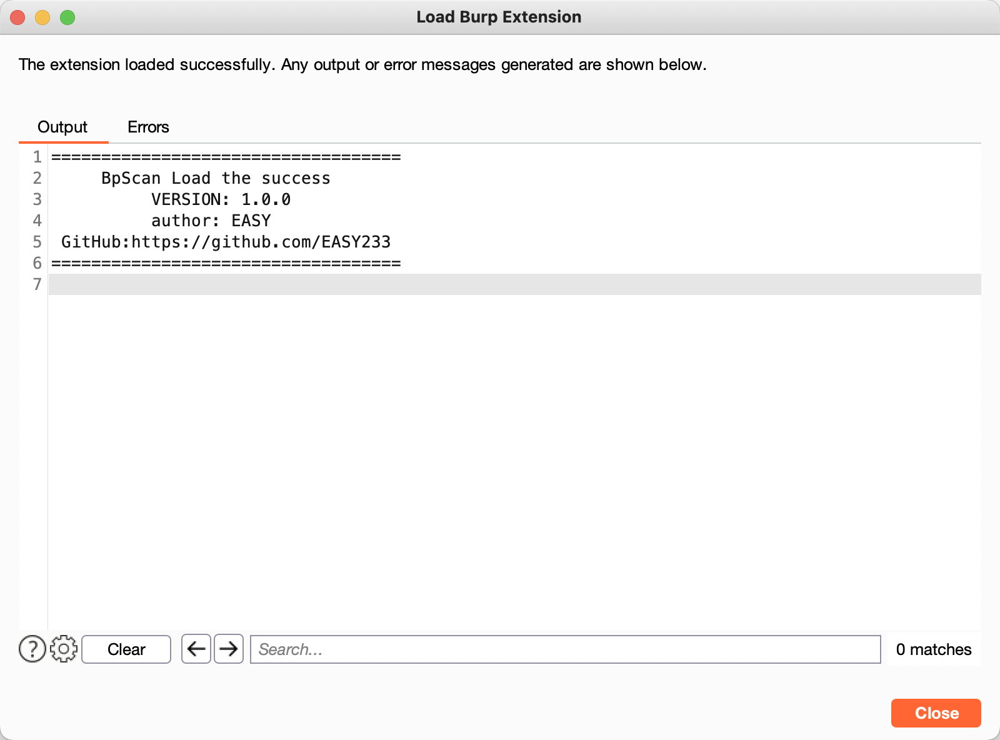

## 简介

BpScan:  一款用于辅助渗透测试工程师日常渗透测试的Burp被动漏扫插件，开发灵感来源于开源项目[GyScan](https://github.com/l1ubai/GyScan)。

##  插件功能

目前BpScan暂时只支持扫描以下漏洞:

- SpringSpiderScan，支持扫描Spring Actuator组件未授权访问，Swagger API 泄露，Druid Monitor 未授权访问，支持路径逐层扫描探测，支持自动Bypass路径(使用Bypass字符..;)。

- Log4jScan,对所有请求参数以及指定的header头进行Log4j Rce漏洞探测。
- FastJsonScan，对POST内容为JSON或者POST参数为JSON处进行FastJson Rce漏洞探测。

## 使用方法

下载releases压缩包,根据自已的需要修改resources中的config.yml配置文件。⚠️目前dnslog探测使用的是[ceye](http://ceye.io/)的在使用前请务必在config.yml文件中修改domain以及token。

然后在Burp Extender标签页导入我们的插件即可，导入成功标志

当我们正常访问网站，网站流量经过Burp，其请求信息符合我们的扫描要求就会开启漏扫，如果有结果那么插件就会在**Dashboard**页面显示。

## 注意事项

1、默认使用jdk1.8编译，若出现jdk问题插件不可用，请下载源码自行编译。

2、有时候流量过大插件扫描会比较慢，请耐心等待插件扫描结束。

3、 目前代码可能还很不成熟，后续更新较快，平时可以多关注一下项目的更新情况。

## 感谢列表

在开发过程中参考学习了非常多前辈们的优秀开源项目，特此感谢!

https://github.com/l1ubai/GyScan

https://github.com/pmiaowu/BurpFastJsonScan

https://github.com/bit4woo/burp-api-drops

